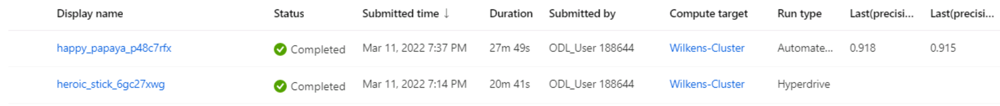

# Optimizing an ML Pipeline in Azure

## Overview
This project is part of the Udacity Azure Machine Learning (ML) Nanodegree. In this project, I built and optimized an Azure ML pipeline using the Python SDK and a provided Scikit-learn model.
This model is then compared to an Azure AutoML run.

### Table of Contents

1. [Summary](#summary)
2. [Scikit-learn Pipeline](#pipeline)
3. [AutoML](#automl)
4. [Pipeline Comparison](#comparison)
5. [Future work](#future)
6. [Clean up](#clean)
7. [Useful Resources](#clean)

## Summary
This project is based on a bank's marketing campaign and the goal of this project is to predict if a customer will sign up for a new term deposit offering.  The dataset used in this project contains data about a bank's marketing campaign including bank client's demographic information.  

Azure AutoML produced the best performing model which was VotingEnsemble with an accurary .91756

## Scikit-learn Pipeline

** Pipeline Architecture

	* Prepare Data
   	* Download the dataset [Data](https://automlsamplenotebookdata.blob.core.windows.net/automl-sample-notebook-data/bankmarketing_train.csv) and convert into TabularDatasetFactory dataset.
	
   	* Clean the dataset (clean_data located in train.py)
   	* Split data into training and test sets (80/20)
   	* Utilize a Scikit-learn Logistic Regression Model for Classification
   
** Hyperparamater Tuning

   hyperdrive_config = HyperDriveConfig (
        * hyperparameter_sampling=RandomParameterSampling(
    		{"--C":choice(0.5,1.0), --max_iter":choice(50,100,150)})  ,
          primary_metric_goal=PrimaryMetricGoal.MAXIMIZE,
          primary_metric_name='Accuracy',
          policy=BanditPolicy(evaluation_interval=1, slack_factor=0.1),
          max_total_runs=8, 
          max_concurrent_runs=4,
          estimator=SKLearn(source_directory='.', entry_script='train.py', compute_target=cluster_name))
           
 ** Classifcation Algorithim
 	* Logistic Regression
   

**Benefits of the parameter sampler chosen**
  RandomParameterSampling supports continous and discrete hyperparamters.  It is also less resource intensive and time consuming.

**Benefits of the early stopping policy chosen**
  Bandit Policy is less resource intensive and time consuming. If a run's performance is outside the best run's performance metrics, if additional runs are outside the evaluation_interval and slack_factor, the run is early terminated -- saving time and resources.

## AutoML
   	* Download the dataset [Data](https://automlsamplenotebookdata.blob.core.windows.net/automl-sample-notebook-data/bankmarketing_train.csv) and convert into   TabularDatasetFactory dataset.
   	* Clean the dataset (clean_data located in train.py)
   	* Split data into training and test sets (80/20)
   	* Configure AutoML
   	* Save Best Model

## Pipeline comparison

## Future Work
**What are some areas of improvement for future experiments? Why might these improvements help the model?**

## Proof of cluster clean up

## Useful Resources
- [ScriptRunConfig Class](https://docs.microsoft.com/en-us/python/api/azureml-core/azureml.core.scriptrunconfig?view=azure-ml-py)
- [Configure and submit training runs](https://docs.microsoft.com/en-us/azure/machine-learning/how-to-set-up-training-targets)
- [HyperDriveConfig Class](https://docs.microsoft.com/en-us/python/api/azureml-train-core/azureml.train.hyperdrive.hyperdriveconfig?view=azure-ml-py)
- [How to tune hyperparamters](https://docs.microsoft.com/en-us/azure/machine-learning/how-to-tune-hyperparameters)

